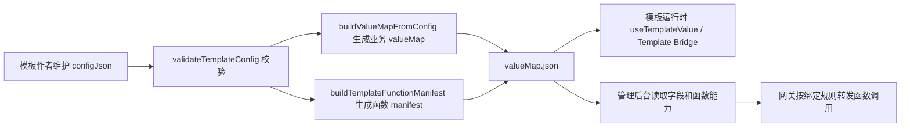

# auto-exhibition-template-sdk 项目理解

## 项目定位

`auto-exhibition-template-sdk` 是面向展览模板项目的前端 SDK。它让模板作者用一份 `configJson` 描述可配置字段和模板能力，并在构建阶段生成后台、客户端和模板页面都能消费的标准产物。

当前版本的核心能力包括：

- 用 `defineTemplateConfig` 定义类型安全的模板配置。
- 用 `templateSdkPlugin` 在 Vite 开发和构建阶段生成 `config.json` 与 `valueMap.json`。
- 用 `useTemplateValue` 在 Vue 模板页面按路径读取运行时配置。
- 用 `configJson.functions` 声明模板暴露函数。
- 用 `valueMap.__templateSdk.functions` 向后台和网关暴露函数 manifest。
- 用 Template Bridge API 注册函数、调用函数，并通过客户端 Bridge 与网关完成本地或跨设备通信。

## 关键数据流

## 仓库边界

- SDK 仓库负责模板侧类型、构建产物、运行时读取和 Template Bridge 前端 API。
- 管理后台负责读取模板函数 manifest、展示可绑定函数，并维护设备/函数绑定规则。
- 客户端和网关负责 Bridge 连接、函数调用转发、规则执行、调用日志和硬件 adapter。
- 硬件协议细节不放进 SDK，应该在网关 adapter 中扩展。

## 重要入口

- `src/sdk/index.ts`：SDK 主入口，导出 Vue 插件、取值 API、校验/构建 API 和 Template Bridge API。
- `src/sdk/types.ts`：字段、配置、valueMap、函数声明、通信目标和调用上下文类型。
- `src/sdk/useTemplateBridge.ts`：模板函数注册、调用、事件兼容 API。
- `src/runtime/schema/validation.ts`：`configJson` 校验逻辑。
- `src/runtime/schema/artifacts.ts`：构建 `configJson`、`valueMap` 和函数 manifest。
- `src/runtime/communication/templateBridge.ts`：通信运行时核心。
- `src/runtime/communication/localBridgeTransport.ts`：默认本地 WebSocket Bridge transport。
- `docs/`：静态文档站。

## 版本 0.2.0 的重点

`0.2.0` 在原有字段配置和页面取值能力之上，加入了模板函数联动链路：

- `functions` 从预留字段变成正式能力声明。
- 构建产物新增 `valueMap.__templateSdk` 元信息。
- SDK 主入口导出 `registerTemplateFunction`、`unregisterTemplateFunction`、`invokeTemplateFunction`、`useTemplateBridge`、`emitTemplateEvent` 和 `onTemplateEvent`。
- 文档新增函数联动指南和 Template Bridge API 页面。
