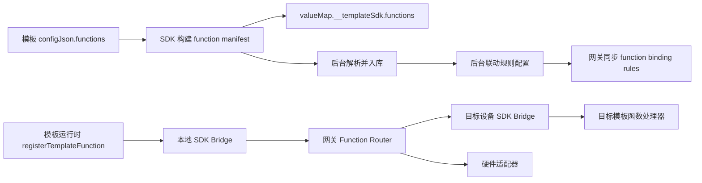

# 设备函数联动能力实现方案

## 1. 背景和目标

当前系统已经完成了基础链路：

1. 管理后台 `mju-smart-show` 维护设备、主题、模板、模板实例和 `valueMap`。
2. 客户端/网关项目 `automatic_exhibition_setup_platform` 定时从后台同步设备与模板关系，并把模板 zip 下载到本地。
3. 展示模板通过 `auto-exhibition-template-sdk` 读取 `configJson + valueMap`。
4. 现有 `exhibition-sdk.js` 已经具备一个轻量跨客户端事件总线：模板页面通过本地 Bridge WebSocket 发送事件，客户端 Bridge 转为 `inter_client_event`，再由网关按单播、组播、广播转发。

本次要增加的能力是：

- 管理后台可以把两个或多个设备关联起来。
- 模板可以声明并暴露可被外部调用的函数，例如 `function1`、`function2`、`playVideo`、`switchScene`。
- 后台能看到每个设备当前模板暴露了哪些函数，并配置“当 A 设备模板的某个函数触发时，调用 B/N 个设备模板的某个函数”。
- 函数调用由网关统一转发，不要求模板直接知道其他设备网络地址。
- SDK 内置通讯能力，让模板作者用统一 API 暴露函数、调用函数和接收调用。
- 这套机制后续可以扩展到硬件，例如灯光、串口屏、传感器、继电器、音响、PLC 等。

方案核心思想：把“模板函数”和“硬件能力”统一抽象为 `Capability`，把“联动配置”抽象为 `Binding Rule`。网关只理解通用协议和路由规则，不理解具体业务含义。

## 2. 当前链路观察

### 2.1 SDK 项目现状

`auto-exhibition-template-sdk` 当前的数据边界是：

- `configJson`：模板作者维护的结构配置。
- `valueMap`：SDK 从 `configJson.dataSchema.fields` 归一化得到的运行时值快照。
- `TemplateSdk`：Vue 插件，运行时加载 `./config.json` 和 `./assets/auto-exhibition-template-sdk/valueMap.json`。
- `useTemplateValue`：模板页面按路径读取 `valueMap`。
- `configJson.functions` 当前只作为保留对象，没有正式的 schema、校验、类型生成和运行时能力。

### 2.2 管理后台现状

`mju-smart-show` 已经有：

- 设备与主题模板配置：`device_theme_config`。
- 模板基础信息：`template_info.config_json`。
- 模板实例：`template_instance.config_json`、`template_instance.value_map`。
- 网关同步接口：`/showroom/client-api/template_sync/getDeviceTemplateRelations`。
- 同步结果 VO：`RelationVo`，包含 `clientId`、`themeId`、`templateInstanceId`、`templateId`、`downloadUrl`、`templateMd5` 等。
- 前端 `TemplateAnalysis` 已经基于新版 SDK 的 `configJson + valueMap` 做内容编辑和发布。

历史 SQL 中可以看到旧模板里存在过 `functions` 配置，例如：

```json
{
  "functions": {
    "playVideo": {
      "params": [{ "name": "id", "type": "string", "source": "timelineItem.id" }],
      "trigger": "click",
      "description": "播放指定节点的视频"
    }
  }
}
```

但当前 `TemplateAnalysis` README 明确写着“不再支持旧结构中的 function”，说明这部分目前没有进入新版 SDK 闭环。

### 2.3 客户端/网关现状

`automatic_exhibition_setup_platform` 已经有：

- 网关 SQLite 表 `device_template_relations`，用于保存后台同步来的设备模板关系。
- 网关 `TemplateSync`，定时调用后台 `getDeviceTemplateRelations`。
- 网关 `routeInterClientEvent`，按 `target.mode` 做 `unicast`、`multicast`、`broadcast` 转发。
- 客户端本地 `exhibition-sdk-bridge.js`，监听 `ws://127.0.0.1:5176`。
- 展示模板侧 `exhibition-sdk.js`，提供 `on`、`off`、`emit`、`onReady`。

现有事件模型是“频道 + payload”，适合自由事件；新能力需要升级为“函数清单 + 函数调用 + 回执 + 后台可配置路由”。

## 3. 总体架构



分层职责：

- SDK：声明函数、暴露函数元数据、注册函数处理器、发起函数调用、接收函数调用。
- 管理后台：解析函数清单、展示函数、维护设备关联和函数绑定规则。
- 网关：同步规则、根据规则转发调用、做鉴权、限流、去重、日志和回执。
- 客户端 Bridge：在模板页面和网关 TCP 连接之间做协议转换。
- 硬件适配层：把硬件能力也注册成函数，让模板函数可以调用硬件，硬件事件也可以触发模板函数。

## 4. 函数声明规范

### 4.1 configJson.functions 新 schema

建议正式把 `configJson.functions` 定义为模板能力清单：

```ts
const configJson = defineTemplateConfig({
  meta: {
    name: '视频播控模板',
    code: 'video-control',
    version: '1.0.0'
  },
  dataSchema: {
    fields: []
  },
  functions: {
    playVideo: {
      label: '播放视频',
      description: '按视频 ID 播放指定视频',
      direction: 'inout',
      params: [
        {
          name: 'id',
          type: 'string',
          label: '视频 ID',
          required: true,
          defaultValue: ''
        },
        {
          name: 'seekTo',
          type: 'number',
          label: '起播秒数',
          required: false,
          defaultValue: 0
        }
      ],
      returns: {
        type: 'object',
        schema: {
          ok: 'boolean',
          currentId: 'string'
        }
      },
      trigger: {
        modes: ['manual', 'click', 'auto'],
        defaultMode: 'manual'
      },
      transport: {
        qos: 'at_most_once',
        timeoutMs: 3000
      }
    },
    pauseVideo: {
      label: '暂停视频',
      description: '暂停当前播放的视频',
      direction: 'in',
      params: []
    }
  }
})
```

字段建议：

| 字段 | 说明 |
| --- | --- |
| `label` | 后台展示名 |
| `description` | 后台说明和模板作者说明 |
| `direction` | `in` 表示可被外部调用，`out` 表示只作为触发源，`inout` 表示两者都支持 |
| `params` | 入参定义，用于后台配置参数映射和运行时校验 |
| `returns` | 返回值定义，用于日志和后续可视化编排 |
| `trigger` | 这个函数常见触发方式，给后台做提示 |
| `transport` | 调用超时、可靠性、是否需要 ACK |
| `tags` | 可选，用于分类，例如 `video`、`scene`、`hardware` |

### 4.2 参数类型

第一期建议支持：

- `string`
- `number`
- `boolean`
- `object`
- `array`
- `any`

后续再扩展：

- `enum`
- `color`
- `duration`
- `percent`
- `file`
- `json-schema`

### 4.3 valueMap 中暴露函数

用户明确希望“将函数暴露出来在 valueMap”。建议不要把函数清单散落到业务字段根节点，而是在 `valueMap` 增加保留命名空间：

```json
{
  "title": "业务字段",
  "__templateSdk": {
    "version": "0.2.0",
    "functions": {
      "playVideo": {
        "name": "playVideo",
        "label": "播放视频",
        "description": "按视频 ID 播放指定视频",
        "direction": "inout",
        "params": [
          { "name": "id", "type": "string", "required": true },
          { "name": "seekTo", "type": "number", "required": false, "defaultValue": 0 }
        ],
        "transport": { "timeoutMs": 3000 }
      }
    }
  }
}
```

这样有三个好处：

1. 后台可以直接从 `valueMap.__templateSdk.functions` 读取函数清单。
2. 不污染业务字段，也避免与用户字段 key 冲突。
3. 未来硬件能力、设备能力、SDK 版本等元信息也可以放进同一个保留命名空间。

同时建议构建阶段额外产出一份可选 manifest：

```text
assets/auto-exhibition-template-sdk/functionManifest.json
```

这不是第一期必须，但后续后台做索引和差量同步会更方便。第一期以 `valueMap.__templateSdk.functions` 为主。

## 5. SDK 改造方案

### 5.1 类型和校验

修改点：

- `src/sdk/types.ts`
- `src/runtime/schema/validation.ts`
- `src/runtime/schema/artifacts.ts`
- `src/runtime/value-map/normalize.ts`
- `src/vite/index.ts`

新增类型：

```ts
export type TemplateFunctionDirection = 'in' | 'out' | 'inout'
export type TemplateFunctionParamType = 'string' | 'number' | 'boolean' | 'object' | 'array' | 'any'

export type TemplateFunctionParam = {
  name: string
  type: TemplateFunctionParamType
  label?: string
  required?: boolean
  defaultValue?: unknown
  description?: string
}

export type TemplateFunctionDefinition = {
  label?: string
  description?: string
  direction?: TemplateFunctionDirection
  params?: TemplateFunctionParam[]
  returns?: unknown
  trigger?: unknown
  transport?: {
    timeoutMs?: number
    qos?: 'at_most_once' | 'at_least_once'
  }
  tags?: string[]
}

export type TemplateFunctionMap = Record<string, TemplateFunctionDefinition>
```

校验规则：

- `functions` 如存在必须是普通对象。
- 函数名必须是非空字符串，建议正则：`^[a-zA-Z_$][\w$.-]{0,63}$`。
- `params` 必须是数组。
- `params[].name` 不能为空且同函数内不重复。
- `params[].type` 必须是支持类型。
- `direction` 默认为 `inout`。
- `transport.timeoutMs` 默认 3000，必须在合理范围，例如 100 到 30000。

### 5.2 构建 valueMap 时写入函数清单

在 `buildTemplateArtifacts` 里处理：

```ts
const artifacts = {
  configJson: normalizedConfig,
  valueMap: {
    ...buildValueMapFromConfig(normalizedConfig),
    __templateSdk: {
      version: SDK_VERSION,
      functions: buildFunctionManifest(normalizedConfig.functions)
    }
  }
}
```

注意点：

- `__templateSdk` 是保留 key。如果模板作者在 `dataSchema.fields` 中声明同名 key，应在校验时报错。
- 函数 manifest 只存元数据，不存 JS 函数体。
- 真实函数实现由模板运行时调用 `registerTemplateFunction` 注册。

### 5.3 通讯 API

SDK 增加一个通讯模块，第一期先封装现有 Bridge WebSocket，后续替换为多 transport。

建议新增导出：

```ts
export function useTemplateBridge(): TemplateBridge
export function registerTemplateFunction(name, handler, options?)
export function unregisterTemplateFunction(name)
export function invokeTemplateFunction(target, name, args?, options?)
export function emitTemplateEvent(channel, payload, target?)
export function onTemplateEvent(channel, handler)
```

模板写法示例：

```ts
import {
  registerTemplateFunction,
  invokeTemplateFunction,
  useTemplateValue
} from 'auto-exhibition-template-sdk'

const tracks = useTemplateValue('tracks', [])

registerTemplateFunction('playVideo', async ({ id, seekTo = 0 }, context) => {
  const item = tracks.value.find((track) => track.id === id)
  if (!item) {
    return { ok: false, message: `video ${id} not found` }
  }

  await player.play(item.url, { seekTo })
  return { ok: true, currentId: id }
})

function handleClick(track) {
  invokeTemplateFunction(
    { mode: 'binding', sourceFunction: 'playVideo' },
    'playVideo',
    { id: track.id }
  )
}
```

这里 `mode: 'binding'` 表示不由模板自己指定目标设备，而由网关根据后台规则解析要调用哪些目标函数。

### 5.4 运行时函数注册

SDK 内部维护函数处理器表：

```ts
type RuntimeFunctionRegistry = Map<string, {
  handler: (args, context) => unknown | Promise<unknown>
  definition?: TemplateFunctionDefinition
}>
```

当 Bridge 收到调用消息：

1. 根据 `functionName` 找 handler。
2. 根据 manifest 校验参数。
3. 调用 handler。
4. 返回 `function_result` 或 `function_error`。

如果模板声明了函数但没有注册 handler：

- SDK 应向控制台警告。
- 网关调用时返回 `FUNCTION_NOT_REGISTERED`。
- 后台可以在设备状态里看到“声明未注册”的诊断信息。

### 5.5 transport 抽象

为了未来接硬件，不要把 SDK 写死在 `ws://127.0.0.1:5176`。建议内部抽象：

```ts
interface TemplateTransport {
  readonly id: string
  readonly connected: boolean
  connect(): Promise<void>
  send(message: TemplateBridgeMessage): void
  onMessage(handler: (message) => void): () => void
  close(): void
}
```

第一期实现：

- `LocalBridgeWebSocketTransport`：对接当前 `exhibition-sdk.js` 的 Bridge 模型。

后续可加：

- `ElectronIpcTransport`
- `MqttTransport`
- `HttpWebhookTransport`
- `SerialTransport`
- `WebBluetoothTransport`
- `WebUsbTransport`
- `NativeHardwareBridgeTransport`

## 6. 管理后台改造方案

### 6.1 新增数据表

#### 6.1.1 模板函数清单表

表名建议：`template_function_manifest`

用途：保存模板或模板实例暴露的函数清单，方便后台展示、查询和做绑定规则校验。

```sql
CREATE TABLE template_function_manifest (
  id BIGINT PRIMARY KEY AUTO_INCREMENT,
  template_info_id BIGINT NOT NULL COMMENT '模板ID',
  template_instance_id BIGINT NULL COMMENT '模板实例ID，可为空表示模板级默认清单',
  function_name VARCHAR(128) NOT NULL COMMENT '函数名',
  function_label VARCHAR(128) NULL COMMENT '展示名',
  direction VARCHAR(16) NOT NULL DEFAULT 'inout' COMMENT 'in/out/inout',
  description VARCHAR(512) NULL,
  params_json JSON NULL COMMENT '参数 schema',
  returns_json JSON NULL COMMENT '返回 schema',
  transport_json JSON NULL COMMENT '超时、qos 等配置',
  tags_json JSON NULL,
  source_hash VARCHAR(64) NULL COMMENT '函数定义 hash，用于判断变化',
  status TINYINT NOT NULL DEFAULT 1 COMMENT '1启用 0禁用',
  create_by VARCHAR(64) NULL,
  create_time DATETIME DEFAULT CURRENT_TIMESTAMP,
  update_by VARCHAR(64) NULL,
  update_time DATETIME DEFAULT CURRENT_TIMESTAMP ON UPDATE CURRENT_TIMESTAMP,
  UNIQUE KEY uk_tpl_func (template_info_id, template_instance_id, function_name),
  KEY idx_tpl_func_template (template_info_id),
  KEY idx_tpl_func_instance (template_instance_id)
);
```

解析来源：

- 模板上传时从 `dist/config.json.functions` 解析。
- 模板实例发布时从 `valueMap.__templateSdk.functions` 或 `configJson.functions` 解析。
- 兼容旧数据时可从 `template_info.config_json.functions` 解析。

#### 6.1.2 设备联动组表

表名建议：`device_link_group`

用途：把两个或多个设备放进一个联动组。联动组可以跨主题，也可以限定某个主题。

```sql
CREATE TABLE device_link_group (
  id BIGINT PRIMARY KEY AUTO_INCREMENT,
  group_code VARCHAR(64) NOT NULL COMMENT '联动组编码',
  group_name VARCHAR(128) NOT NULL COMMENT '联动组名称',
  theme_id BIGINT NULL COMMENT '限定主题，不填表示全局',
  description VARCHAR(512) NULL,
  status TINYINT NOT NULL DEFAULT 1,
  create_by VARCHAR(64) NULL,
  create_time DATETIME DEFAULT CURRENT_TIMESTAMP,
  update_by VARCHAR(64) NULL,
  update_time DATETIME DEFAULT CURRENT_TIMESTAMP ON UPDATE CURRENT_TIMESTAMP,
  UNIQUE KEY uk_group_code (group_code)
);
```

#### 6.1.3 设备联动组成员表

表名建议：`device_link_group_member`

```sql
CREATE TABLE device_link_group_member (
  id BIGINT PRIMARY KEY AUTO_INCREMENT,
  group_id BIGINT NOT NULL,
  device_id BIGINT NOT NULL COMMENT '后台 device_info.id',
  client_id VARCHAR(128) NOT NULL COMMENT '设备 code，对应网关 clientId',
  role VARCHAR(32) NULL COMMENT 'source/target/both/controller/display/hardware',
  sort_no INT DEFAULT 0,
  status TINYINT NOT NULL DEFAULT 1,
  create_time DATETIME DEFAULT CURRENT_TIMESTAMP,
  UNIQUE KEY uk_group_device (group_id, client_id),
  KEY idx_member_client (client_id),
  KEY idx_member_group (group_id)
);
```

#### 6.1.4 函数绑定规则表

表名建议：`function_binding_rule`

用途：描述“源函数触发后调用哪些目标函数”。

```sql
CREATE TABLE function_binding_rule (
  id BIGINT PRIMARY KEY AUTO_INCREMENT,
  rule_name VARCHAR(128) NOT NULL,
  group_id BIGINT NULL COMMENT '所属联动组',
  theme_id BIGINT NULL COMMENT '限定主题',

  source_client_id VARCHAR(128) NULL COMMENT '源设备 clientId，空表示组内任意设备',
  source_template_id BIGINT NULL,
  source_template_instance_id BIGINT NULL,
  source_function_name VARCHAR(128) NOT NULL,

  trigger_mode VARCHAR(32) NOT NULL DEFAULT 'after_call'
    COMMENT 'manual/click/after_call/event/schedule/hardware_event',
  condition_json JSON NULL COMMENT '触发条件',

  target_mode VARCHAR(32) NOT NULL DEFAULT 'selected'
    COMMENT 'selected/group/broadcast/hardware/external',
  target_json JSON NOT NULL COMMENT '目标设备、目标函数、硬件能力列表',
  args_mapping_json JSON NULL COMMENT '参数映射规则',

  execution_mode VARCHAR(32) NOT NULL DEFAULT 'parallel'
    COMMENT 'parallel/serial/first_success',
  timeout_ms INT NOT NULL DEFAULT 3000,
  retry_count INT NOT NULL DEFAULT 0,
  prevent_loop TINYINT NOT NULL DEFAULT 1,

  status TINYINT NOT NULL DEFAULT 1,
  create_by VARCHAR(64) NULL,
  create_time DATETIME DEFAULT CURRENT_TIMESTAMP,
  update_by VARCHAR(64) NULL,
  update_time DATETIME DEFAULT CURRENT_TIMESTAMP ON UPDATE CURRENT_TIMESTAMP,

  KEY idx_rule_source (source_client_id, source_function_name),
  KEY idx_rule_group (group_id),
  KEY idx_rule_theme (theme_id),
  KEY idx_rule_status (status)
);
```

`target_json` 示例：

```json
[
  {
    "endpointType": "template",
    "clientId": "DEV-A-001",
    "templateInstanceId": 1001,
    "functionName": "playVideo"
  },
  {
    "endpointType": "template",
    "clientId": "DEV-B-002",
    "templateInstanceId": 1002,
    "functionName": "switchScene"
  },
  {
    "endpointType": "hardware",
    "hardwareId": "light-01",
    "functionName": "setBrightness"
  }
]
```

`args_mapping_json` 示例：

```json
{
  "mode": "mapping",
  "mappings": [
    { "targetParam": "id", "source": "args.id" },
    { "targetParam": "seekTo", "value": 0 },
    { "targetParam": "fromDevice", "source": "context.from.clientId" }
  ]
}
```

#### 6.1.5 函数调用日志表

表名建议：`function_call_log`

第一期可选，但强烈建议做。跨设备联动没有日志会很难排查。

```sql
CREATE TABLE function_call_log (
  id BIGINT PRIMARY KEY AUTO_INCREMENT,
  trace_id VARCHAR(64) NOT NULL,
  message_id VARCHAR(64) NOT NULL,
  rule_id BIGINT NULL,
  source_client_id VARCHAR(128) NULL,
  source_function_name VARCHAR(128) NULL,
  target_client_id VARCHAR(128) NULL,
  target_endpoint_type VARCHAR(32) NULL,
  target_function_name VARCHAR(128) NULL,
  args_json JSON NULL,
  result_json JSON NULL,
  status VARCHAR(32) NOT NULL COMMENT 'pending/sent/success/error/timeout/skipped',
  error_code VARCHAR(64) NULL,
  error_message VARCHAR(512) NULL,
  started_at DATETIME DEFAULT CURRENT_TIMESTAMP,
  finished_at DATETIME NULL,
  duration_ms INT NULL,
  KEY idx_trace_id (trace_id),
  KEY idx_message_id (message_id),
  KEY idx_source (source_client_id, source_function_name),
  KEY idx_target (target_client_id, target_function_name)
);
```

### 6.2 后端 API

新增管理端 API：

```text
GET    /showroom/template_function/list?templateInfoId=&templateInstanceId=
POST   /showroom/template_function/refresh/{templateInfoId}

GET    /showroom/device_link_group/list
POST   /showroom/device_link_group
PUT    /showroom/device_link_group
DELETE /showroom/device_link_group/{id}

GET    /showroom/device_link_group/{id}/members
POST   /showroom/device_link_group/{id}/members
DELETE /showroom/device_link_group/{id}/members/{memberId}

GET    /showroom/function_binding_rule/list
POST   /showroom/function_binding_rule
PUT    /showroom/function_binding_rule
DELETE /showroom/function_binding_rule/{id}

GET    /showroom/function_call_log/list
```

新增网关同步 API：

```text
GET /showroom/client-api/function_sync/getFunctionBindings?gatewayId=&timestamp=
```

返回结构：

```json
{
  "syncTime": "2026-05-29T10:00:00.000Z",
  "manifests": [],
  "groups": [],
  "members": [],
  "rules": []
}
```

如果第一期想减少网关同步体积，可以只返回：

- 与当前用户/网关下设备相关的 group/member/rule。
- 当前主题相关规则。
- 最近变更规则。

### 6.3 后台前端页面

建议新增两个入口。

#### 6.3.1 模板函数面板

位置：

- `TemplateAnalysis` 弹窗内新增“函数能力”Tab。
- 模板详情页新增“暴露函数”区域。

展示内容：

- 函数名。
- 展示名。
- 方向：可被调用/可触发/双向。
- 参数列表。
- 返回值。
- 描述。
- 模板实例来源。
- 是否已被联动规则使用。

限制：

- 后台不编辑函数实现，只编辑联动规则。
- 如果模板声明了函数但实际设备运行时未注册 handler，后台设备状态页应提示。

#### 6.3.2 设备联动编排页面

推荐页面结构：

- 左侧：联动组列表。
- 中间：组内设备和当前主题模板。
- 右侧：函数绑定规则。

创建规则流程：

1. 选择源设备或“组内任意设备”。
2. 选择源模板函数。
3. 选择触发模式。
4. 选择目标设备，可多选。
5. 选择每个目标设备上的目标函数。
6. 配置参数映射。
7. 配置执行模式、超时、重试、防循环。
8. 保存并提示“网关将在下一次同步后生效”，也可以提供“立即同步网关”按钮。

## 7. 网关和客户端改造方案

### 7.1 网关 SQLite 新表

在 `automatic_exhibition_setup_platform/gateway/electron/core/database.js` 新增本地缓存表：

```sql
CREATE TABLE IF NOT EXISTS function_binding_rules (
  id TEXT PRIMARY KEY,
  rule_name TEXT NOT NULL,
  group_id TEXT,
  theme_id TEXT,
  source_client_id TEXT,
  source_template_id TEXT,
  source_template_instance_id TEXT,
  source_function_name TEXT NOT NULL,
  trigger_mode TEXT,
  condition_json TEXT,
  target_mode TEXT NOT NULL,
  target_json TEXT NOT NULL,
  args_mapping_json TEXT,
  execution_mode TEXT DEFAULT 'parallel',
  timeout_ms INTEGER DEFAULT 3000,
  retry_count INTEGER DEFAULT 0,
  prevent_loop INTEGER DEFAULT 1,
  status INTEGER DEFAULT 1,
  remote_updated_at TEXT,
  synced_at TEXT NOT NULL
);
```

可选表：

```sql
CREATE TABLE IF NOT EXISTS device_link_groups (...);
CREATE TABLE IF NOT EXISTS device_link_group_members (...);
CREATE TABLE IF NOT EXISTS template_function_manifests (...);
CREATE TABLE IF NOT EXISTS function_call_logs (...);
```

第一期网关最少需要 `function_binding_rules`。函数 manifest 可以不全量落网关，只在路由时使用规则中的 target。

### 7.2 新增 FunctionSync 调度器

参考现有 `template-sync.js`：

- 新增 `gateway/electron/template/function-sync.js`。
- 新增 `gateway/electron/api/showroom/functionApi.js`。
- 定时请求后台 `getFunctionBindings`。
- 写入本地 SQLite。
- 发生变化时通过 IPC 和移动端 WebSocket 推送状态。

也可以第一期把函数规则同步合并进现有 `template_sync` 返回体，但长期建议拆分，避免模板包同步和联动规则同步互相影响。

### 7.3 扩展 Bridge 协议

当前模板侧消息只有：

- `emit_event`
- `ping`
- `get_client_id`

建议新增：

模板 -> 本地 Bridge：

```json
{
  "type": "register_functions",
  "manifest": {},
  "registeredNames": ["playVideo", "pauseVideo"]
}
```

```json
{
  "type": "invoke_function",
  "messageId": "msg-1",
  "traceId": "trace-1",
  "target": { "mode": "binding", "sourceFunction": "playVideo" },
  "functionName": "playVideo",
  "args": { "id": "v1" },
  "options": { "timeoutMs": 3000 }
}
```

本地 Bridge -> 模板：

```json
{
  "type": "invoke_function",
  "messageId": "msg-2",
  "traceId": "trace-1",
  "from": {
    "clientId": "DEV-A",
    "functionName": "playVideo"
  },
  "functionName": "pauseVideo",
  "args": {}
}
```

模板 -> 本地 Bridge 回执：

```json
{
  "type": "function_result",
  "messageId": "msg-2",
  "traceId": "trace-1",
  "ok": true,
  "result": { "currentId": "v1" }
}
```

本地 Bridge -> 网关 TCP：

```json
{
  "type": "template_function_call",
  "messageId": "msg-1",
  "traceId": "trace-1",
  "from": {
    "clientId": "DEV-A",
    "templateInstanceId": "1001",
    "functionName": "playVideo"
  },
  "target": {
    "mode": "binding",
    "sourceFunction": "playVideo"
  },
  "functionName": "playVideo",
  "args": { "id": "v1" },
  "ts": 1710000000000,
  "ttl": 8,
  "hops": []
}
```

网关 -> 客户端：

```json
{
  "type": "template_function_call",
  "messageId": "msg-2",
  "traceId": "trace-1",
  "ruleId": "rule-100",
  "from": {
    "clientId": "DEV-A",
    "functionName": "playVideo"
  },
  "to": {
    "clientId": "DEV-B",
    "templateInstanceId": "1002",
    "functionName": "switchScene"
  },
  "functionName": "switchScene",
  "args": { "scene": "detail" },
  "ts": 1710000000001,
  "ttl": 7,
  "hops": ["gateway-01"]
}
```

### 7.4 Function Router

在网关 `main.js` 中新增 `routeTemplateFunctionCall`，不要塞进现有 `routeInterClientEvent` 里硬扩展。

路由流程：

1. 校验消息基本字段。
2. 生成或沿用 `traceId`。
3. 检查 `ttl` 和 `hops`，防止循环调用。
4. 如果 `target.mode === 'binding'`：
   - 按 `source_client_id/source_function_name/theme_id/group_id` 查询启用规则。
   - 校验条件 `condition_json`。
   - 根据 `args_mapping_json` 生成目标参数。
   - 按 `target_json` 展开目标。
5. 如果 `target.mode === 'unicast'`：
   - 作为低级能力直接发给指定设备函数。
6. 如果目标是模板：
   - 查询在线 `clients`。
   - 发送 `template_function_call` 到目标客户端。
7. 如果目标是硬件：
   - 调用硬件适配器。
8. 写调用日志。
9. 收集回执，必要时回发给源设备。

第一期可以只做 fire-and-forget，再逐步补齐 result 聚合。推荐一开始就保留 `messageId/traceId`，避免后续协议迁移。

### 7.5 客户端 Bridge 改造

文件：

- `client/electron/template/exhibition-sdk-bridge.js`
- `client/electron/gateway/server-message-handler.js`
- `client/web/exhibition-sdk.js`
- `gateway/electron/template/exhibition-sdk.js`

改造点：

- Bridge 保存本地模板连接列表时，记录每个连接注册了哪些函数。
- 收到网关 `template_function_call` 时，优先发给注册了该函数的模板连接。
- 如果同一设备有多个模板页面连接，支持：
  - `target.templateSessionId` 精确命中。
  - 否则广播给注册了该函数的所有页面。
- 收到模板 `function_result` 后回传网关。
- 老的 `emit_event` 保持兼容。

### 7.6 和现有 ExhibitionSDK 的关系

短期做法：

- 在 `auto-exhibition-template-sdk` 内部复用现有 Bridge 协议，不要求模板作者再手动引入 `exhibition-sdk.js`。
- `exhibition-sdk.js` 可以继续保留给非 Vue 或旧模板使用。

中期做法：

- 把 `exhibition-sdk.js` 的能力沉淀成 `auto-exhibition-template-sdk` 的 `communication` 模块。
- 给非 Vue 模板提供独立 UMD 构建，例如：

```html
<script src="/auto-exhibition-template-sdk.global.js"></script>
```

这样 Vue 模板和普通 HTML 模板都走同一套函数调用协议。

## 8. 硬件扩展方案

### 8.1 统一 Endpoint 模型

不要把规则表写死为“设备模板调用设备模板”。建议目标统一为 endpoint：

```ts
type Endpoint =
  | { endpointType: 'template'; clientId: string; templateInstanceId?: string; functionName: string }
  | { endpointType: 'hardware'; hardwareId: string; functionName: string }
  | { endpointType: 'gateway'; functionName: string }
  | { endpointType: 'external_api'; apiId: string; functionName: string }
```

这样未来可以支持：

- 模板函数 -> 模板函数
- 模板函数 -> 灯光控制
- 模板函数 -> 串口屏
- 硬件传感器事件 -> 模板函数
- 管理后台手动按钮 -> 模板函数
- 定时任务 -> 模板函数

### 8.2 硬件能力清单

新增硬件能力注册：

```json
{
  "hardwareId": "light-01",
  "type": "dmx-light",
  "name": "大厅灯光",
  "functions": {
    "setBrightness": {
      "label": "设置亮度",
      "direction": "in",
      "params": [
        { "name": "value", "type": "number", "required": true }
      ]
    },
    "setColor": {
      "label": "设置颜色",
      "direction": "in",
      "params": [
        { "name": "hex", "type": "string", "required": true }
      ]
    }
  },
  "events": {
    "motionDetected": {
      "label": "检测到人体移动",
      "payload": { "zone": "string" }
    }
  }
}
```

后台把硬件函数和模板函数展示在同一个联动配置界面。

### 8.3 硬件适配器接口

网关侧定义：

```ts
interface HardwareAdapter {
  id: string
  type: string
  getManifest(): HardwareManifest
  invoke(functionName: string, args: unknown, context: InvokeContext): Promise<unknown>
  onEvent(handler: (event: HardwareEvent) => void): void
}
```

第一批可选适配器：

- TCP/UDP socket。
- SerialPort。
- MQTT。
- HTTP webhook。
- Modbus TCP/RTU。
- DMX/Art-Net。

硬件事件进入系统后，也转成统一消息：

```json
{
  "type": "hardware_function_event",
  "from": { "endpointType": "hardware", "hardwareId": "sensor-01", "eventName": "motionDetected" },
  "payload": { "zone": "A" },
  "traceId": "trace-xxx"
}
```

然后走同一套 `function_binding_rule`。

## 9. 端到端调用流程

### 9.1 A 模板函数触发 B/N 模板函数

1. 模板 A 在 `configJson.functions` 声明 `playVideo`。
2. 模板 A 运行时 `registerTemplateFunction('playVideo', handler)`。
3. SDK 连接本地 Bridge，发送 `register_functions`。
4. 后台解析模板函数，用户在联动页面创建规则：
   - 源：A 设备当前模板 `playVideo`
   - 目标：B 设备模板 `switchScene`，C 设备模板 `highlightItem`
5. 网关同步规则。
6. A 模板触发 `invokeTemplateFunction({ mode: 'binding', sourceFunction: 'playVideo' }, 'playVideo', args)`。
7. 本地 Bridge 转发给网关。
8. 网关 Function Router 命中规则，生成 B/C 的目标调用消息。
9. B/C 客户端 Bridge 把调用交给目标模板。
10. B/C 模板执行 handler 并返回 result。
11. 网关记录日志，并按需要把聚合结果回发给 A。

### 9.2 管理后台手动测试函数

1. 用户在后台设备详情页选择某台设备、某个模板函数。
2. 后台发请求给网关或等待规则同步后由网关发起测试。
3. 网关发送 `template_function_call` 到目标设备。
4. 目标设备返回 result。
5. 后台展示调用成功、失败、超时和返回值。

### 9.3 硬件触发模板

1. 硬件适配器注册 `motionDetected` 事件。
2. 后台配置规则：`sensor-01.motionDetected` -> `DEV-B.playVideo`。
3. 网关收到硬件事件。
4. Function Router 命中规则并转发到模板函数。

## 10. 参数映射规则

后台规则中需要支持参数映射，否则“函数可见”但“不好编排”。

第一期支持三种来源：

```json
[
  { "targetParam": "id", "source": "args.id" },
  { "targetParam": "seekTo", "value": 0 },
  { "targetParam": "fromClientId", "source": "context.from.clientId" }
]
```

来源路径：

- `args.xxx`：源函数调用参数。
- `result.xxx`：源函数执行结果，适合串行规则。
- `context.from.clientId`
- `context.from.functionName`
- `context.themeId`
- 常量 `value`

第二期支持表达式：

```json
{ "targetParam": "scene", "expr": "args.category === 'intro' ? 'opening' : 'detail'" }
```

表达式要用安全沙箱，不能直接 `eval`。

## 11. 安全、稳定性和防循环

必须内置：

- `traceId`：一次联动链路全程共用。
- `messageId`：单个消息唯一。
- `ttl`：每经过一次路由减 1，默认 8。
- `hops`：记录经过的网关、设备、函数。
- `prevent_loop`：规则级防循环开关。
- `timeoutMs`：每个目标调用超时。
- `retryCount`：失败重试次数，默认 0。
- 频率限制：同源函数每秒最多触发 N 次。
- 参数大小限制：payload 默认不超过 64KB。
- 函数 allowlist：只能调用 manifest 中声明并启用的函数。
- 来源校验：Bridge 强制使用本机真实 `clientId`，不信任模板传入的 `from`。
- 日志脱敏：参数里可能包含 URL、token 或业务数据，日志保存前可配置脱敏字段。

## 12. 兼容策略

### 12.1 对现有模板

- 不声明 `functions` 的模板不受影响。
- 旧的 `useTemplateValue` 行为不变。
- 旧的 `ExhibitionSDK.emit/on` 继续可用。
- `valueMap.__templateSdk` 是新增保留 key，模板业务字段不应使用。

### 12.2 对现有网关

- 没有同步到 `function_binding_rules` 时，网关只保留旧的 `inter_client_event` 能力。
- 客户端 Bridge 不支持 `template_function_call` 时，网关降级为不可达并记录日志。

### 12.3 对旧 configJson.functions

可以写一个兼容转换：

旧：

```json
{
  "functions": {
    "playVideo": {
      "params": [{ "name": "id", "type": "string" }],
      "trigger": "click",
      "description": "播放视频"
    }
  }
}
```

转换为新：

```json
{
  "functions": {
    "playVideo": {
      "label": "playVideo",
      "description": "播放视频",
      "direction": "inout",
      "params": [{ "name": "id", "type": "string", "required": false }],
      "trigger": { "modes": ["click"], "defaultMode": "click" }
    }
  }
}
```

## 13. 分阶段落地计划

### Phase 1：函数声明和后台可见

目标：后台能看到模板暴露了哪些函数。

工作项：

1. SDK 定义 `configJson.functions` schema。
2. SDK 校验函数声明。
3. SDK 构建 `valueMap.__templateSdk.functions`。
4. Vite 类型声明生成补充函数类型。
5. 管理后台上传/解析模板时读取函数清单。
6. 新增 `template_function_manifest` 表和基础 API。
7. `TemplateAnalysis` 新增函数能力展示 Tab。

验收：

- 上传一个含 `functions` 的模板，后台能展示函数名、参数和说明。
- 构建产物 `valueMap.json` 中有 `__templateSdk.functions`。
- 不含 `functions` 的模板仍可正常编辑和发布。

### Phase 2：SDK 运行时注册和本地 Bridge

目标：模板能注册函数，Bridge 能把调用发到模板并拿到结果。

工作项：

1. SDK 新增 `registerTemplateFunction`。
2. SDK 新增 `invokeTemplateFunction`。
3. SDK 封装本地 Bridge transport。
4. 客户端 `exhibition-sdk-bridge.js` 支持 `register_functions`、`invoke_function`、`function_result`。
5. 本地单设备测试：模板 A 页面调用同设备模板 B 页面函数。

验收：

- 模板函数 handler 能被外部消息调用。
- 未注册函数返回明确错误。
- result/error 能回到调用方。

### Phase 3：后台联动规则和网关路由

目标：A 设备触发函数后，网关按后台规则调用 B/N 设备函数。

工作项：

1. 后台新增联动组和绑定规则表。
2. 后台新增联动配置页面。
3. 后台新增 `function_sync` 接口。
4. 网关新增 `FunctionSync`。
5. 网关新增 `routeTemplateFunctionCall`。
6. 网关新增调用日志。

验收：

- 管理后台配置 A.playVideo -> B.switchScene。
- A 设备触发后 B 设备模板函数被调用。
- 多目标并行调用正常。
- 离线目标、超时目标有日志。

### Phase 4：硬件能力接入

目标：模板函数和硬件能力可以互相联动。

工作项：

1. 网关定义 HardwareAdapter。
2. 先实现一个简单 HTTP/MQTT/串口适配器。
3. 后台新增硬件能力清单展示。
4. 函数绑定规则支持 `endpointType: hardware`。
5. 硬件事件可作为源触发模板函数。

验收：

- 模板按钮能控制一个硬件模拟器。
- 硬件模拟事件能触发模板函数。
- 后台调用日志中能看到硬件 endpoint。

### Phase 5：可视化编排和高级能力

目标：让非开发人员可以拖拽式配置复杂联动。

工作项：

1. 参数映射可视化。
2. 条件判断。
3. 串行/并行/失败分支。
4. 调用链追踪视图。
5. 网关实时推送规则变更，减少轮询延迟。

## 14. 推荐优先实现的最小闭环

如果希望最快验证价值，建议先做这个闭环：

1. SDK 支持 `functions` schema 和 `valueMap.__templateSdk.functions`。
2. SDK 支持 `registerTemplateFunction`、`invokeTemplateFunction`。
3. 客户端 Bridge 支持 `template_function_call`。
4. 后台新增一张 `function_binding_rule`，先不做复杂联动组。
5. 网关同步规则后，按 `source_client_id + source_function_name` 找目标。
6. 后台做一个简版配置页：源设备/源函数 -> 多个目标设备/目标函数。

最小版本可以暂时不做：

- 硬件适配。
- 复杂参数表达式。
- result 聚合。
- 拖拽编排。
- 实时推送同步。

## 15. 关键文件改造清单

### SDK

- `src/sdk/types.ts`
- `src/sdk/index.ts`
- `src/runtime/schema/validation.ts`
- `src/runtime/schema/artifacts.ts`
- `src/runtime/value-map/normalize.ts`
- `src/runtime/context/createTemplateContext.ts`
- 新增 `src/runtime/communication/*`
- 新增 `src/sdk/useTemplateBridge.ts`
- `src/vite/index.ts`
- `README.md`
- `docs/*`
- `skill/generate-template-project/generate-template-project.skill.md`

### 管理后台 mju-smart-show

- 新增 SQL 迁移脚本。
- 新增 domain/mapper/service/controller：
  - `TemplateFunctionManifest`
  - `DeviceLinkGroup`
  - `DeviceLinkGroupMember`
  - `FunctionBindingRule`
  - `FunctionCallLog`
- 修改 `TemplateZipParseUtil`，解析 `functions`。
- 修改 `TemplateSyncMapper.xml` 或新增 `FunctionSyncMapper.xml`。
- 新增 client-api：`function_sync/getFunctionBindings`。
- 前端新增：
  - 模板函数展示 Tab。
  - 设备联动组页面。
  - 函数绑定规则页面。
  - 调用日志页面。

### 客户端/网关 automatic_exhibition_setup_platform

- `gateway/electron/core/database.js`
- 新增 `gateway/electron/template/function-sync.js`
- 新增 `gateway/electron/api/showroom/functionApi.js`
- `gateway/electron/main.js`
- `client/electron/template/exhibition-sdk-bridge.js`
- `client/electron/gateway/server-message-handler.js`
- `client/web/exhibition-sdk.js`
- `gateway/electron/template/exhibition-sdk.js`
- `shared-types.ts`

## 16. 风险和注意事项

1. `valueMap` 里加入 `__templateSdk` 需要保留命名空间校验，避免模板业务字段冲突。
2. 函数 manifest 只是元数据，不能当作真实函数体；真实执行必须由运行时注册 handler。
3. 后台展示“有函数”不等于设备已在线且 handler 已注册，需要设备运行时状态反馈。
4. 跨设备联动必须有防循环和限流，否则 A -> B -> A 很容易打满网关。
5. 参数映射不要第一期就做复杂表达式，先做路径映射和常量。
6. 网关不要解析业务 payload，但可以解析通用协议字段、规则和 endpoint。
7. 硬件接入应走 adapter，不要把串口/MQTT/HTTP 等具体协议写进模板 SDK。
8. 旧的 `ExhibitionSDK.emit/on` 要保留，避免已有演示模板失效。
9. 后台同步接口应按用户、网关或设备范围过滤，避免把全量规则下发给所有网关。
10. 函数调用日志要可控增长，需要清理策略或按时间归档。

## 17. 最终效果示例

模板 A：

```ts
registerTemplateFunction('playVideo', async ({ id }) => {
  await player.play(id)
  await invokeTemplateFunction(
    { mode: 'binding', sourceFunction: 'playVideo' },
    'playVideo',
    { id }
  )
  return { ok: true, id }
})
```

后台规则：

```json
{
  "ruleName": "主屏播放时联动副屏详情",
  "sourceClientId": "SCREEN-A",
  "sourceFunctionName": "playVideo",
  "targetJson": [
    {
      "endpointType": "template",
      "clientId": "SCREEN-B",
      "functionName": "showDetail"
    },
    {
      "endpointType": "hardware",
      "hardwareId": "LIGHT-01",
      "functionName": "setBrightness"
    }
  ],
  "argsMappingJson": {
    "mappings": [
      { "targetParam": "id", "source": "args.id" },
      { "targetParam": "value", "value": 80 }
    ]
  }
}
```

运行效果：

- A 播放视频。
- 网关命中规则。
- B 展示对应详情。
- 灯光亮度调到 80。
- 调用链在后台日志中可追踪。

## 18. 结论

这次能力建议不要只做成“模板 A 发事件给模板 B”，而要抽象成“能力清单 + 联动规则 + 通用函数调用协议”。这样当前能满足多设备模板互调，后续也能自然接入硬件、外部 API、后台手动触发和自动化编排。

第一期最重要的是打通函数清单和最小调用闭环：SDK 产出函数 manifest，后台能看见函数，网关能按规则转发调用，目标模板能执行注册的 handler。只要这个闭环稳了，硬件和复杂编排都可以在同一模型上继续加。
